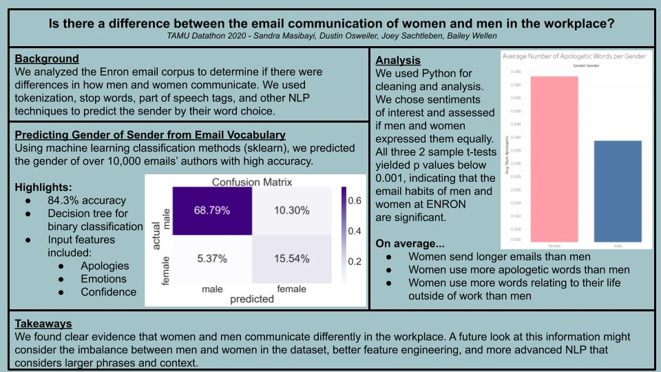

# Enron-Email-Gender-Analysis
## Investigating differences in professional email communication between men and women.  

We started this project because we have noticed that females seem to apologize more in professional and academic settings. We decided to assess the validity of this observation by analyzing the vocabulary used in professional emails. This project began at the [TAMU Datathon 2020](https://tamudatathon.com/) and is an ongoing project by Carthage College Data Science Club members.  

  
## Natural Language Processing methods included:  
* tokenization  
* stop words 
* part of speech tagging  
* sentiment analysis  
 
## Machine Learning methods included:  
* Decision Tree for Binary Classification  
* Confusion Matrix  
* Oversampling Techniques  

## Statistical Analysis methods included:  
* 2 sample t tests  
* Data visualization  

## Tools and technologies used:  
* Python (Jupyter Notebooks)  
    * nltk  
    * sklearn  
    * gender-guesser
    * imblearn.over_sampling  
    * scipy  
    * wordcloud  
    * numpy  
    * pandas  
* Tableau  

## See our findings in the poster and video:  

[Project Presentation Video](https://www.youtube.com/watch?v=OcqLI3W5q8c&feature=emb_logo&ab_channel=DustinOsweiler)

  

## Authors  
Dustin Osweiler (dosweiler@carthage.edu)  
Joey Sachtleben (jsactleben@carthage.edu)  
Bailey Wellen (bwellen@carthage.edu)  

